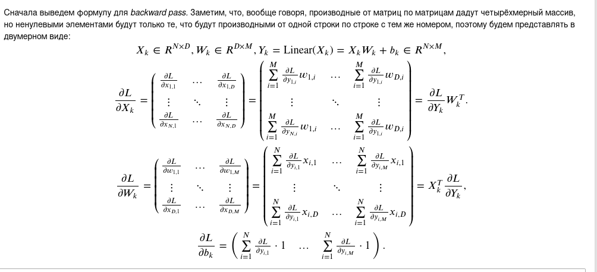
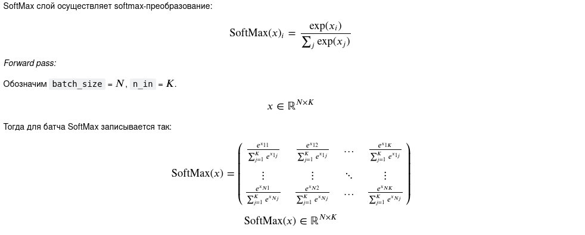
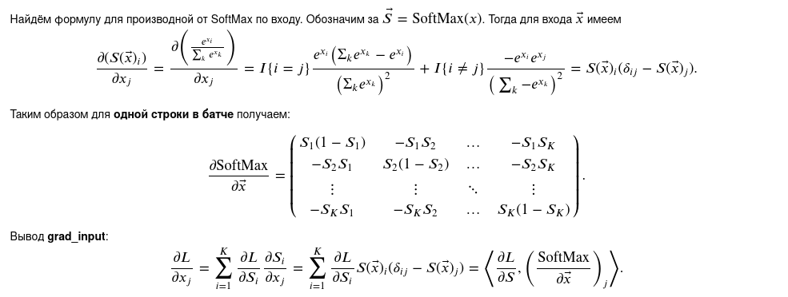
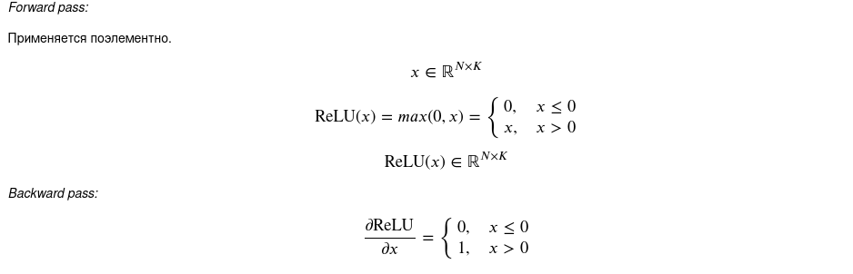
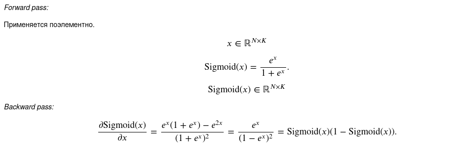
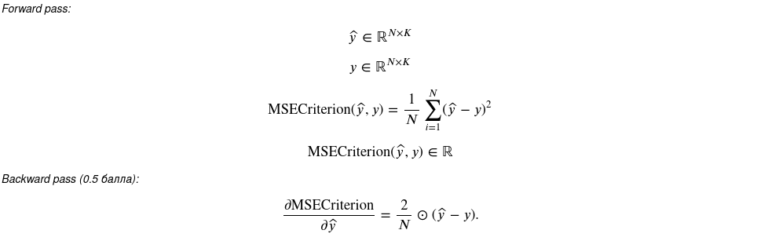
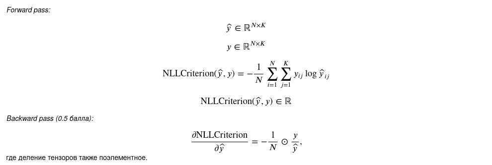

Пояснение по слоям
1) Линейный слой.
   
   
2) SoftMax слой.
   
   

Пояснение по функциям активации.
1) ReLU.
   
   
2) Sigmoid.
   
   
Пояснение по лоссам.
1) MSE loss.
   
   
2) Cross-entropy loss (NLL loss).
   
   
3) Kullback-Leibler divergence loss.

   Отличается от `CrossEntropy` loss только лишь на энтропию истинного распределения.
   Градиент остаётся таким же.
   
Замечания: 1) убрал apply_grad, потому что лучше передавать параметры , 
чем оптимизатор в каждый слой
2) убрал step в Model, потому что он не нужен
3) Выделил отдельно forward, так понятнее и по pytorch
4) optimizer внутри слоя не нужен (FullyConnectedLayer)
5) Добавил отдельный интерфейс для лоссов, так как они отличаются семантикой функций 
   `forward()`, `backward)` от интерфейса `Module`.
