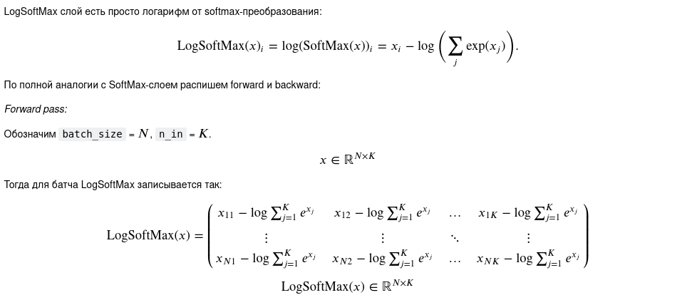
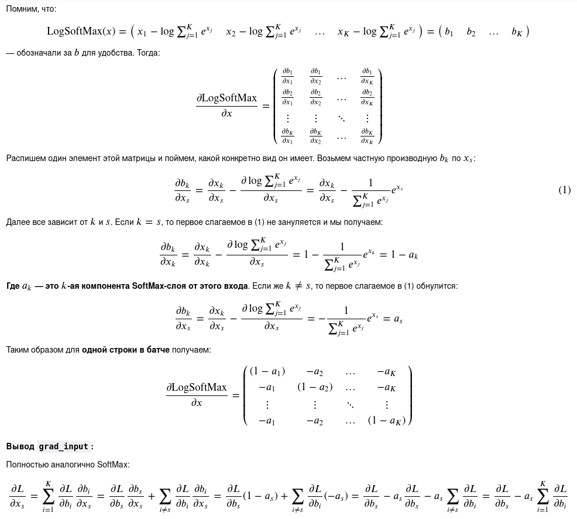
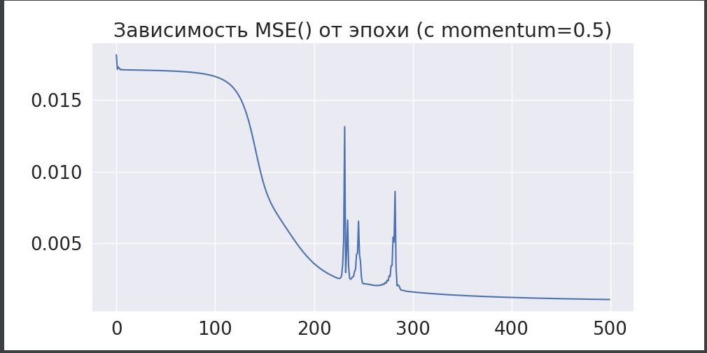
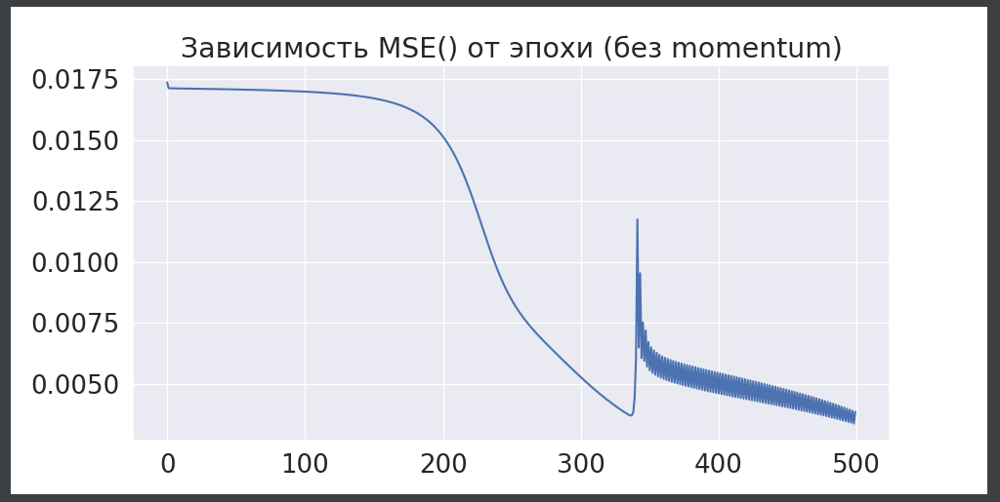

Пояснение по слоям
1) Линейный слой.
   
   
2) SoftMax слой.
   
   
   
3) LogSoftMax слой.
   
   

Пояснение по функциям активации.
1) ReLU.
   
   
2) Sigmoid.
   
   
Пояснение по лоссам.
1) MSE loss.
   
   
2) Cross-entropy loss.
   
   
3) Kullback-Leibler divergence loss.

   Отличается от `CrossEntropy` loss только лишь на энтропию истинного распределения.
   Градиент остаётся таким же.
   
**Замечания:**
1) убрал `apply_grad()`, потому что лучше передавать параметры оптимизатору, 
чем оптимизатор в каждый слой;
2) убрал step в Model, потому что он не нужен;
3) Выделил отдельно вызов `forward()`, так понятнее и в стиле pytorch;
4) параметр `optimizer` не нужен внутри `FullyConnectedLayer`, см. п. 1;
5) Добавил отдельный интерфейс для лоссов, так как они отличаются семантикой функций 
   `forward()`, `backward)` от интерфейса `Module`.
   
**Выводы при обучении на датасете iris.**
Сначала была предложена модель в виде двух полносвязных слоёв (4, 30), (30, 3) с двумя 
сигмоидами. Обучил на 100 итерациях, точность была примерно 0.56. Посмотрел на график 
лосса, понял, что число итераций маленькое. Увеличил до 300, стало 0.80. Увеличил до 1000,
не помогло.

Тогда я подумал, что `ReLu` будет лучше, её часто хвалят. Попробовал с ней, так там вообще
0.37 на 1000 итерациях (видимо, переобучилась?), 0.80 на 300. Понял, что нужно менять слои,
добавил ещё два слоя, расширил число нейронов до 100 в середине, вернул сигмоиды,
поставил 500 итераций и получил скор 1.00, в то время как `LogisticRegression` получает лишь 0.967.
Также стоит отметить, что использовался `SGD` с `momentum=0.5`. Без него сходимость
медленнее. Вот графики:

