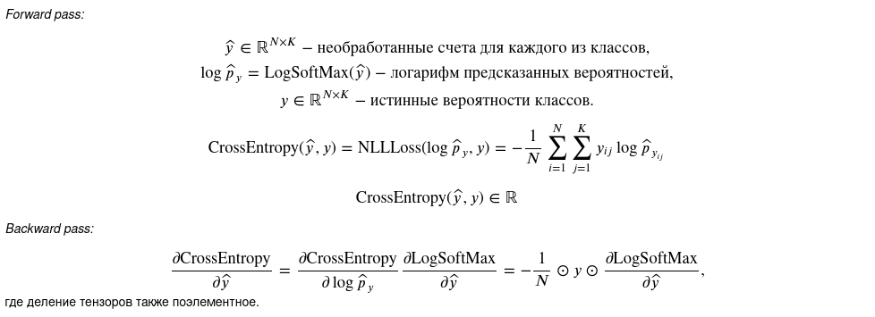

Пояснение по линейному слою.

Пояснение по функциям активации.
1) ReLU.
   
2) Sigmoid.
   
   
Пояснение по лоссам.
1) MSE loss.
   
2) Cross-entropy loss (NLL loss).
   
3) Kullback-Leibler divergence loss.
   
Замечания: 1) убрал apply_grad, потому что лучше передавать параметры
2) убрал step в Model, потому что он не нужен
3) Выделил отдельно forward, так понятнее и по pytorch
4) 
